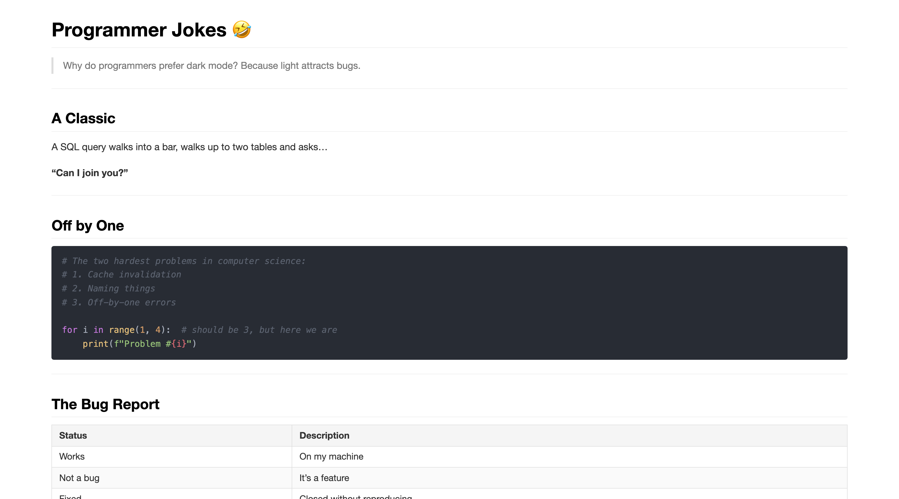

# pretty-md

> Instantly render any Markdown file beautifully in your browser from the terminal.

[](https://github.com/get-ai-native/pretty-md/actions/workflows/ci.yml)
[](https://www.npmjs.com/package/@get-ai-native/pretty-md)
[](LICENSE)
[](https://nodejs.org)

## Screenshots



## Features

- **Zero config**: point it at any `.md` file and it opens in your default browser
- **GitHub-flavored Markdown**: tables, strikethrough, task lists, and more via [markdown-it](https://github.com/markdown-it/markdown-it)
- **stdin support**: pipe output from any command directly
- **Programmatic API**: use it as a library in your own tools

## Installation

```bash
npm install -g @get-ai-native/pretty-md
```

Or use it once without installing:

```bash
npx @get-ai-native/pretty-md README.md
```

## Usage

```
pretty-md [options] [file.md]
cat file.md | pretty-md

Options:
  -o, --output <file>  Write HTML to <file> instead of a temp file
      --no-open        Write HTML but do not open the browser
  -V, --version        Print version and exit
  -h, --help           Show this help
```

### Examples

```bash
# Open a file in the browser
pretty-md README.md

# Pipe from stdin
cat NOTES.md | pretty-md

# Save to a specific HTML file
pretty-md -o docs/index.html README.md

# Generate HTML without opening the browser (prints the output path)
pretty-md --no-open README.md
```

## Programmatic API

```js
import { render, buildHtml } from 'pretty-md';

const body = render('# Hello\n\nWorld');
const html = buildHtml(body, { title: 'My Doc' });

console.log(html); // complete HTML document string
```

### `render(markdown: string): string`

Converts a Markdown string to an HTML fragment using markdown-it.

### `buildHtml(body: string, opts?: { title?: string }): string`

Wraps an HTML fragment in a complete, styled HTML document.

### `openInBrowser(filePath: string): boolean`

Opens a local file in the default browser. Returns `true` on success.

## Requirements

- Node.js 18 or later

## Contributing

Contributions are welcome! Please open an issue or pull request.

1. Fork the repo and create your branch from `main`
2. Run `npm install`
3. Make your changes with tests: `npm test`
4. Check linting: `npm run lint`
5. Open a pull request

## License

[MIT](LICENSE)
